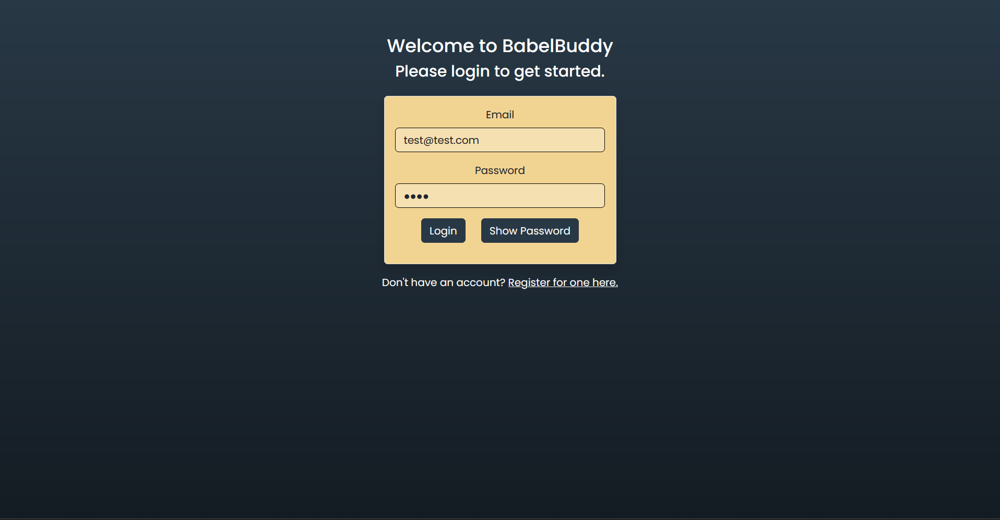
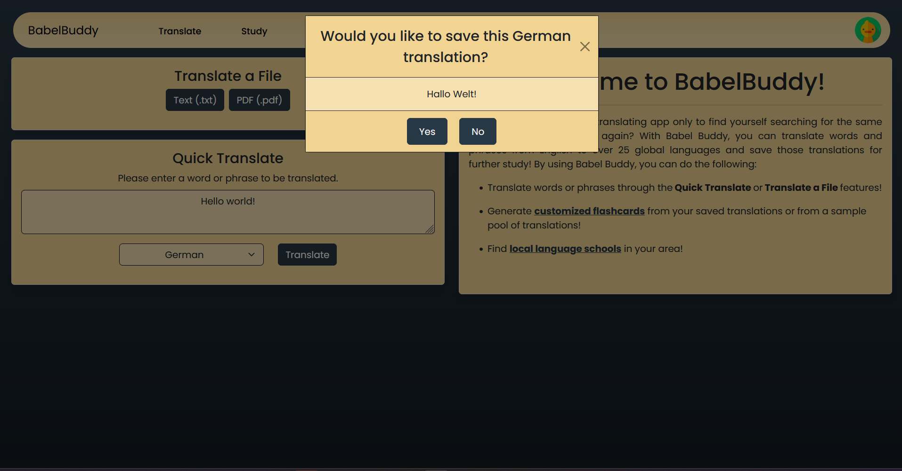
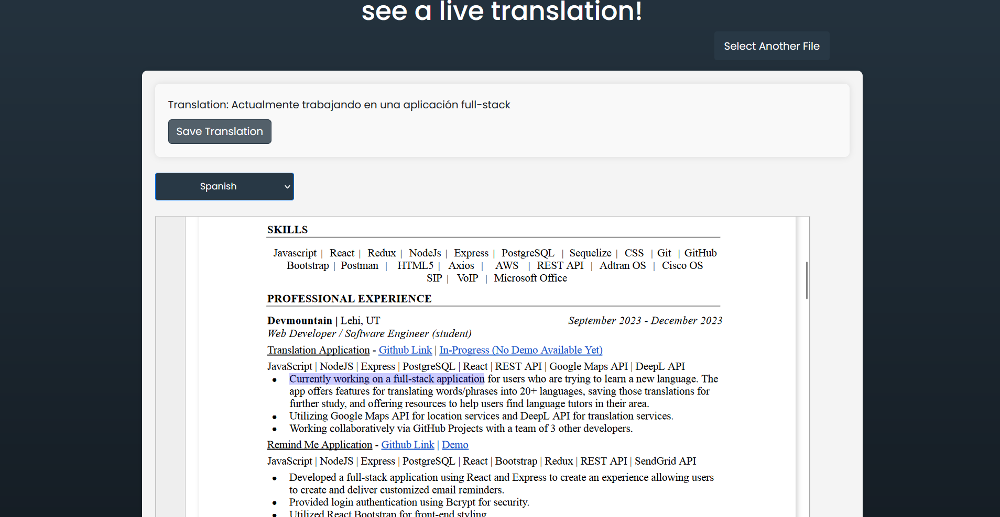
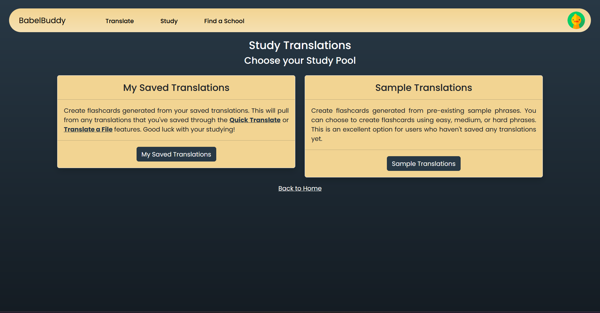
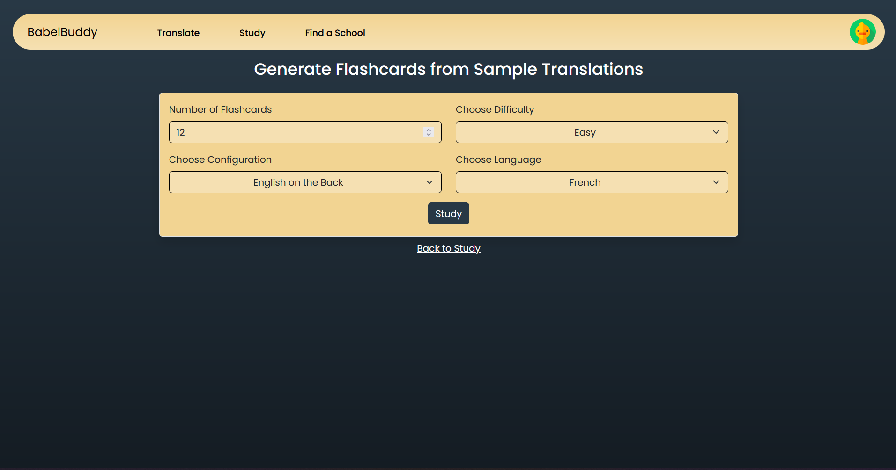
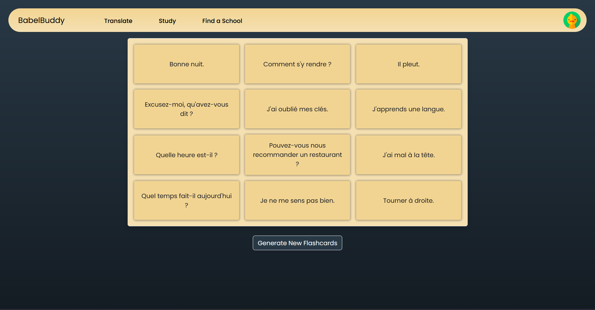
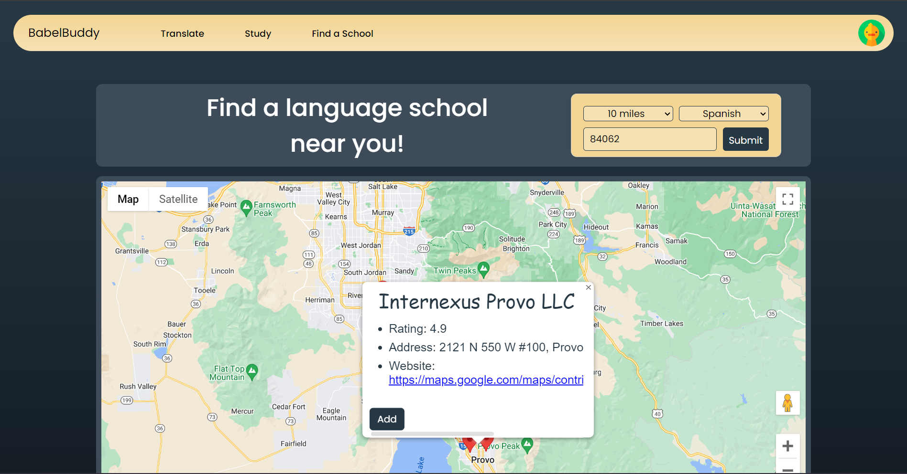
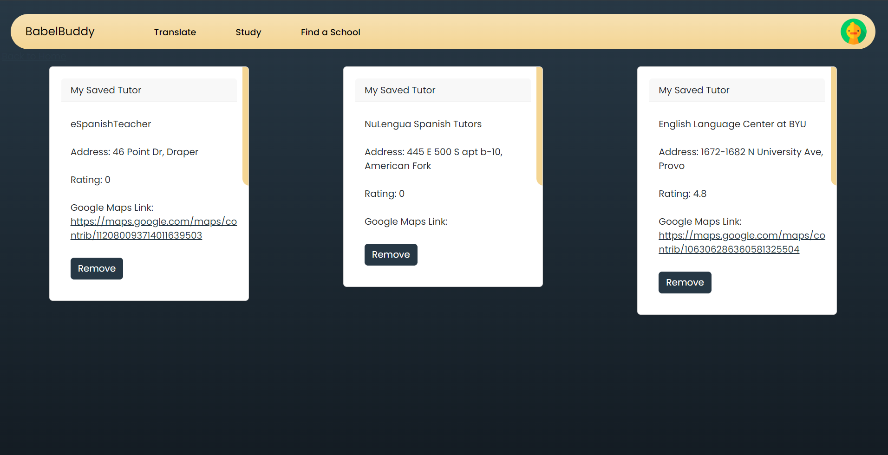
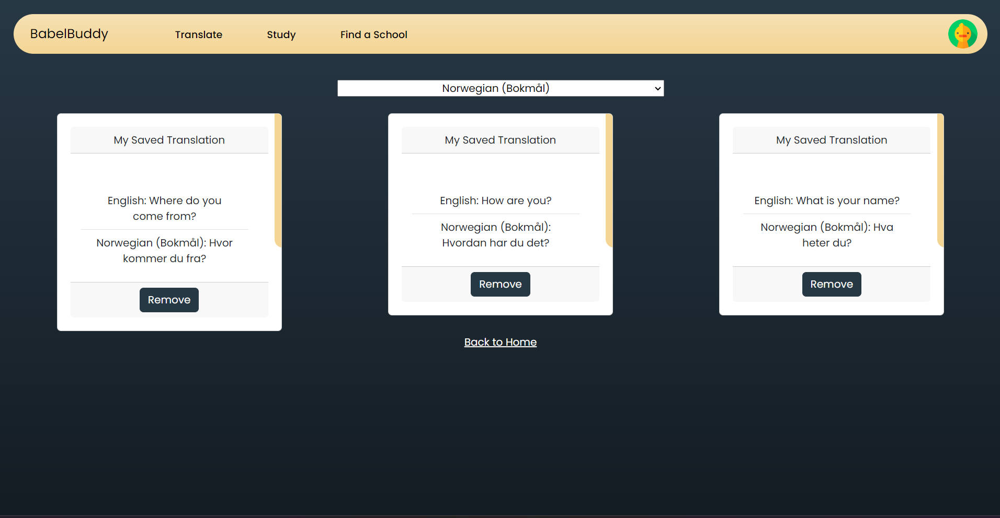
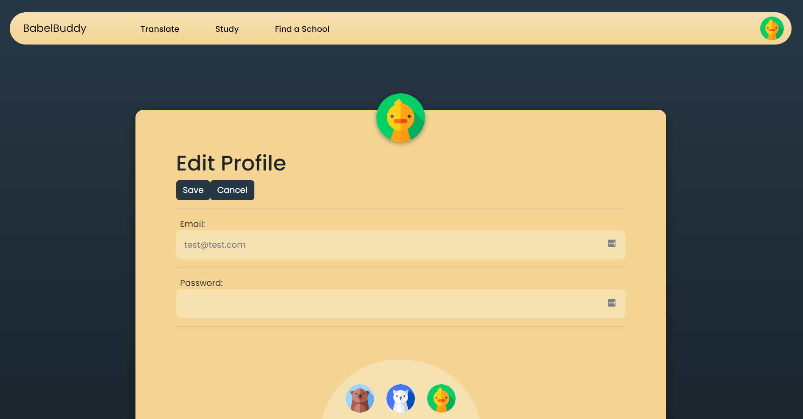

# Welcome to BabelBuddy!

Have you ever used a language program to translate something only to forget it and translate it again? **BabelBuddy** allows you to not only translate words and phrases, but it also allows you to save those translations for future study! In addition to this, you can use **BabelBuddy** to find language schools near you if you're ready to take your language learning to the next level!

**BabelBuddy** was built by the following developers as part of their group capstone project with DevMountain:
* [Amy Andrew](https://www.linkedin.com/in/amy-andrew-19631b257/)
* [Colten Yorgason](https://www.linkedin.com/in/colten-yorgason-0853b0189/)
* [Eric Hoffman](https://www.linkedin.com/in/erichoffman98/)
* [Kadin Tanner](https://www.linkedin.com/in/kadin-tanner-5b523a296/)

## Table of Contents
1. [Technologies and Frameworks](https://github.com/EricTheHoff/translationApp#technologies-and-frameworks)
2. [How to Run **BabelBuddy** Locally](https://github.com/EricTheHoff/translationApp#how-to-run-babelbuddy-locally)
3. [How to Use **BabelBuddy**](https://github.com/EricTheHoff/translationApp#how-to-use-babelbuddy)

## Technologies and Frameworks
* JavaScript
* HTML5
* CSS
* React
  * React Bootstrap
  * React Redux
  * React Router
  * React Hot Toast
* Node/Express.js
* PostgreSQL
* Sequelize ORM
* REST APIs
  * Google Maps API
  * DeepL API
* Bcrypt
* Axios

## How to Run **BabelBuddy** Locally
**BabelBuddy** has not been deployed as a live application, so it has to be ran locally.

After downloading the GitHub repository and added it to a local directory, run the following terminal commands:
* `npm i` or `npm install` *(Installs project dependencies)*
* `npm run initdb` and `npm run seed` *(Creates and seeds the database)*
* `npm run dev` *(Launches the application)*
  * Currently, the URL for the app is set to http://localhost:2222

Please note that **BabelBuddy** makes use of two API keys; Google Maps API and DeepL API. In order to use the translation and map features, you will need to create a `.env` file and add the following variables:
* `VITE_REACT_APP_GOOGLE_API_KEY`
* `REACT_APP_DEEPL_API_KEY`

Once you connect your respective keys to these variables, you should be good to go!

## How to Use **BabelBuddy**
1. Log into the application with your email and password (or register for one if you don't have an account).

2. From the Home Page, you can use the Quick Translate feature to translate a word or phrase.

Alternatively, you can also translate a word or phrase from a file.

3. To study your translations, you can go to the Study Page and choose to generate flashcards from your saved translations or from a set of pre-loaded sample translations.

4. To find a language school near you, go to the Find a School page. You can enter in a zip code, language, and radius to find language schools near you. You can save schools to your account so you can compare them later.

5. To view your saved schools or saved translations, simply hover over your profile and select them from the pop-up menu.

6. To Edit your Profile information, navigate to the Profile option when hovering over your profile.
